# UnisportAI

**Course Project: Fundamentals and Methods of Computer Science**

[](https://unisportai.streamlit.app)

       

A Streamlit web application for discovering university sports courses at the University of St. Gallen (HSG). This project demonstrates the application of programming, databases, data science, and machine learning concepts learned in the course.

## Project Overview

This application helps students find sports activities that match their preferences using:
- **Data filtering**: Search by time, location, sport type, and intensity
- **Machine learning**: KNN-based recommendations for personalized suggestions
- **Data visualization**: Charts showing course availability patterns
- **User interaction**: Interactive filters and personalized recommendations

## Data Flow Architecture

```mermaid
flowchart TD
    A[🌐 Unisport Website] --> B[Web Scraping]

    B --> C[📊 Scraper Scripts]
    C --> D[Extract Offers]
    C --> E[Extract Courses]
    C --> F[Extract Locations]
    C --> G[Extract Dates]

    D --> H[(📚 Supabase PostgreSQL)]
    E --> H
    F --> H
    G --> H

    H --> I[sportangebote]
    H --> J[sportkurse]
    H --> K[kurs_termine]
    H --> L[unisport_locations]
    H --> M[trainer]
    H --> N[kurs_trainer]

    I --> O[🔧 ML Training Data]
    O --> P[🤖 KNN Training]
    P --> Q[💾 Trained Model]

    I --> R[👁️ Application Views]
    J --> R
    K --> R
    L --> R
    M --> R
    N --> R

    R --> S[vw_offers_complete]
    R --> T[vw_termine_full]

    S --> U[🎯 Streamlit App]
    T --> U
    Q --> U

    U --> V[🏃‍♂️ Sports Overview]
    U --> W[📅 Course Dates]
    U --> X[👤 My Profile]
    U --> Y[📊 Analytics]

    V --> Z[🔍 Filtering]
    Z --> AA[🎯 ML Recommendations]
    AA --> V

    U --> BB[📝 ETL Logging]
    BB --> CC[🔄 Scheduled Updates]
    CC --> B

    classDef source fill:#e1f5fe,stroke:#01579b,stroke-width:2px
    classDef process fill:#fff3e0,stroke:#ef6c00,stroke-width:2px
    classDef storage fill:#f3e5f5,stroke:#6a1b9a,stroke-width:2px
    classDef ml fill:#e8f5e8,stroke:#2e7d32,stroke-width:2px
    classDef app fill:#fff8e1,stroke:#f57f17,stroke-width:2px
    classDef user fill:#fce4ec,stroke:#c2185b,stroke-width:2px

    class A source
    class B,C,D,E,F,G process
    class H,I,J,K,L,M,N storage
    class O,P,Q ml
    class R,S,T storage
    class U,V,W,X,Y app
    class Z,AA user
    class BB,CC process
```



**Data Flow Overview**: This diagram shows the complete data pipeline from web scraping Unisport website data through database storage, ML training, and user interface display. The system includes automated ETL processes, machine learning recommendations, and real-time filtering.

## Getting Started

### Prerequisites
- Python 3.9+
- Supabase account (free tier available)

### Quick Setup

1. **Clone and install:**
   ```bash
   git clone https://github.com/lhagenmayer/UnisportAI.git
   cd UnisportAI
   pip install -r requirements.txt
   ```

2. **Set up database:**
   - Create a Supabase project at https://supabase.com
   - Run the SQL from `schema.sql` in your Supabase SQL editor

3. **Configure credentials:**
   Create `.streamlit/secrets.toml`:
   ```toml
   [connections.supabase]
   SUPABASE_URL = "your_supabase_url"
   SUPABASE_KEY = "your_supabase_key"
   ```

4. **Run the app:**
   ```bash
   streamlit run streamlit_app.py
   ```

### Course Requirements Met

This project fulfills all mandatory course requirements:

1. ✅ **Problem statement**: Helps students discover suitable sports courses
2. ✅ **Data loading**: Loads course data from Supabase database and web scraping
3. ✅ **Data visualization**: Interactive charts for course availability and recommendations
4. ✅ **User interaction**: Filters, personalization, and ML recommendations
5. ✅ **Machine learning**: KNN algorithm for personalized sport suggestions
6. ✅ **Documentation**: Well-commented source code
7. ✅ **Team contributions**: Documented in analytics section
8. ✅ **Video presentation**: 4-minute demo video (separate deliverable)

---

## Features

### 🏋️ Sports Discovery
- Browse available sports courses with detailed information
- Filter by intensity, focus areas, and social settings
- Search by location, time, and sport type

### 🤖 AI Recommendations
- Machine learning-powered personalized suggestions
- KNN algorithm matches user preferences to sports
- Adjustable match score thresholds

### 📊 Analytics & Charts
- Course availability by weekday and time of day
- Interactive visualizations using Plotly
- Team contribution matrix

### 👤 User Features
- Optional Google OAuth authentication
- Personalized filter preferences
- Session management

## Filter System Architecture

```mermaid
flowchart TD
    A[User] --> B[Sidebar]

    B --> C[Offer Filters]
    B --> D[Event Filters]
    B --> E[ML Filters]

    C --> F[Intensity]
    C --> G[Focus]
    C --> H[Setting]

    D --> I[Sports]
    D --> J[Weekdays]
    D --> K[Time]
    D --> L[Locations]

    F --> M[(Session State)]
    G --> M
    H --> M
    I --> M
    J --> M
    K --> M
    L --> M

    M --> N[Filter Processing]
    N --> O{Offer Filters?}

    O -->|Yes| P[filter_offers]
    O -->|No| Q[filter_events]

    P --> R[100% Match]
    R --> S[ML Recommendations]
    S --> T[KNN Model]
    T --> U[User Vector]
    U --> V[Find Neighbors]
    V --> W[Calculate Scores]

    Q --> X[Event Validation]
    X --> Y{Sport Match?}
    Y -->|Yes| Z{Time Match?}
    Y -->|No| AA[Exclude Event]

    Z -->|Yes| BB{Location Match?}
    Z -->|No| AA

    BB -->|Yes| CC[Include Event]
    BB -->|No| AA

    W --> DD[Merge Results]
    CC --> DD

    DD --> EE[Soft Filtering]
    EE --> FF{Score ≥ threshold?}

    FF -->|Yes| GG[Show Result]
    FF -->|No| HH[Hide Result]

    GG --> II[UI Display]
    II --> JJ[Color Coding]
    JJ --> KK[Sort by Score]

    classDef input fill:#e1f5fe
    classDef process fill:#fff3e0
    classDef logic fill:#f3e5f5
    classDef result fill:#e8f5e8

    class A,B,C,D,E,F,G,H,I,J,K,L input
    class N,P,Q,R,S,T,U,V,W,X,DD,EE process
    class O,Y,Z,BB,FF logic
    class GG,HH,JJ,KK result
```



**Filter System Overview**: This diagram illustrates the sophisticated filtering architecture with offer-level (sports characteristics) and event-level (specific dates/times) filters, combined with KNN-based ML recommendations. The system uses AND logic for hard filtering and score reduction for soft filtering to ensure relevant results.

## Technologies Used

- **Frontend**: Streamlit
- **Backend**: Python, Supabase (PostgreSQL)
- **ML**: scikit-learn (KNN algorithm)
- **Data**: pandas, numpy
- **Visualization**: Plotly
- **Web scraping**: requests, beautifulsoup4

## Project Structure

```
UnisportAI/
├── streamlit_app.py           # Main application
├── utils/                     # Utility modules
├── ml/                       # Machine learning components
├── .scraper/                 # Web scraping scripts
├── schema.sql                # Database schema
└── requirements.txt          # Python dependencies
```

## Database Schema

The application uses Supabase (PostgreSQL) with the following core tables:

### Core Tables
- **`users`** - User accounts and authentication data
- **`sportangebote`** - Sports offers (name, description, intensity, focus, setting)
- **`sportkurse`** - Individual courses within offers
- **`kurs_termine`** - Course dates and times with location info
- **`unisport_locations`** - Physical locations with coordinates
- **`trainer`** - Instructor information
- **`kurs_trainer`** - Many-to-many relationship between courses and trainers
- **`etl_runs`** - Logging for data scraping operations

### Views
- **`vw_offers_complete`** - Enriched offers with event counts and trainer lists
- **`vw_termine_full`** - Course dates with sport names and trainer info
- **`ml_training_data`** - Feature vectors for machine learning (13 numeric columns)

The complete schema is defined in `schema.sql` and should be run in a fresh Supabase project.

## Team & Contributions

This project was developed by a team of 5 students as part of the "Fundamentals and Methods of Computer Science" course at the University of St. Gallen (HSG):

### Team Members
- **[Tamara Nessler](https://www.linkedin.com/in/tamaranessler/)**
- **[Till Banerjee](https://www.linkedin.com/in/till-banerjee/)**
- **[Sarah Bugg](https://www.linkedin.com/in/sarah-bugg/)**
- **[Antonia Büttiker](https://www.linkedin.com/in/antonia-büttiker-895713254/)**
- **[Luca Hagenmayer](https://www.linkedin.com/in/lucahagenmayer/)**
